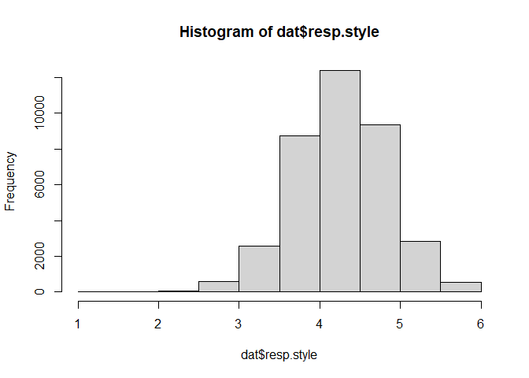

# Preparations

## Load packages


```r
library(rio)
```

```
## The following rio suggested packages are not installed: 'arrow', 'feather', 'fst', 'hexView', 'pzfx', 'readODS', 'rmatio'
## Use 'install_formats()' to install them
```

```r
library(dplyr)
```

```
## 
## Attaching package: 'dplyr'
```

```
## The following objects are masked from 'package:stats':
## 
##     filter, lag
```

```
## The following objects are masked from 'package:base':
## 
##     intersect, setdiff, setequal, union
```

## Load data


```r
# Long format data with ESS and CHES merged
dat<-import("../../data/processed/dat.xlsx")

# ESS raw data from which variable labels can be obtained
ESS.dat<-import("../../data/raw/ESS7e02_2.sav")
```

# Variable transformations

## Gender


```r
attr(ESS.dat$gndr,"labels")
```

```
##      Male    Female No answer 
##         1         2         9
```

```r
# Factorial gndr

dat$gndr.f<-case_when(dat$gndr==1~"Male",
                      dat$gndr==2~"Female",
                      TRUE~NA_character_)

table(dat$gndr.f,useNA="always")
```

```
## 
## Female   Male   <NA> 
##  21292  18871     22
```

```r
# Numerical gndr

dat$gndr.c<-case_when(dat$gndr==1~-0.5,
                      dat$gndr==2~0.5,
                      TRUE~NA_real_)

table(dat$gndr.c,useNA="always")
```

```
## 
##  -0.5   0.5  <NA> 
## 18871 21292    22
```

## Age


```r
attr(ESS.dat$agea,"labels")
```

```
## Not available 
##           999
```

```r
table(dat$agea==999)
```

```
## 
## FALSE 
## 40086
```

```r
# centered age divided by 10
dat$age10.c<-(dat$agea-mean(dat$agea,na.rm=T))/10
```

## Income


```r
attr(ESS.dat$hinctnta,"labels")
```

```
##  J - 1st decile  R - 2nd decile  C - 3rd decile  M - 4th decile 
##               1               2               3               4 
##  F - 5th decile  S - 6th decile  K - 7th decile  P - 8th decile 
##               5               6               7               8 
##  D - 9th decile H - 10th decile         Refusal      Don't know 
##               9              10              77              88 
##       No answer 
##              99
```

```r
# recode deciles to quintiles

dat$income<-case_when(
  dat$hinctnta==1 | dat$hinctnta==2 ~ "quint.1",
  dat$hinctnta==3 | dat$hinctnta==4 ~ "quint.2",
  dat$hinctnta==5 | dat$hinctnta==6 ~ "quint.3",
  dat$hinctnta==7 | dat$hinctnta==8 ~ "quint.4",
  dat$hinctnta==9 | dat$hinctnta==10 ~ "quint.5"
)

table(dat$income,useNA="always")
```

```
## 
## quint.1 quint.2 quint.3 quint.4 quint.5    <NA> 
##    6427    6999    6793    6408    5262    8296
```

```r
# add missing as additional factor level (to a new variable income.f)

dat$income.f<-case_when(
  is.na(dat$income) ~ "missing",
  TRUE ~ dat$income
)

#define reference level (top quintile)
table(dat$income.f,useNA="always")
```

```
## 
## missing quint.1 quint.2 quint.3 quint.4 quint.5    <NA> 
##    8296    6427    6999    6793    6408    5262       0
```

```r
dat$income.fr = relevel(as.factor(dat$income.f),
                        ref="quint.5")
table(dat$income.fr,useNA="always")
```

```
## 
## quint.5 missing quint.1 quint.2 quint.3 quint.4    <NA> 
##    5262    8296    6427    6999    6793    6408       0
```

## Education


```r
attr(ESS.dat$eisced,"labels")
```

```
##             Not possible to harmonise into ES-ISCED 
##                                                   0 
##              ES-ISCED I , less than lower secondary 
##                                                   1 
##                        ES-ISCED II, lower secondary 
##                                                   2 
##           ES-ISCED IIIb, lower tier upper secondary 
##                                                   3 
##           ES-ISCED IIIa, upper tier upper secondary 
##                                                   4 
##        ES-ISCED IV, advanced vocational, sub-degree 
##                                                   5 
##     ES-ISCED V1, lower tertiary education, BA level 
##                                                   6 
## ES-ISCED V2, higher tertiary education, >= MA level 
##                                                   7 
##                                               Other 
##                                                  55 
##                                             Refusal 
##                                                  77 
##                                          Don't know 
##                                                  88 
##                                           No answer 
##                                                  99
```

```r
# recode education variable

dat$edu<-case_when(dat$eisced==0~NA_character_,
                   dat$eisced==1~"1. <LS",
                   dat$eisced==2~"2. LS",
                   dat$eisced==3~"3. LUS",
                   dat$eisced==4~"4. UUS",
                   dat$eisced==5~"5. AV",
                   dat$eisced==6~"6. BA",
                   dat$eisced==7~"7. MA",
                   TRUE~NA_character_)

table(dat$edu,useNA="always")
```

```
## 
## 1. <LS  2. LS 3. LUS 4. UUS  5. AV  6. BA  7. MA   <NA> 
##   4085   6760   7213   7094   5671   4366   4730    266
```

```r
# recode reference education (highest) to a new variable (edu.f)

dat$edu.f<-relevel(as.factor(dat$edu),ref="7. MA")
table(dat$edu.f)
```

```
## 
##  7. MA 1. <LS  2. LS 3. LUS 4. UUS  5. AV  6. BA 
##   4730   4085   6760   7213   7094   5671   4366
```

```r
# code binary (college=0.5, no college=-0.5)

dat$edu.c<-case_when(dat$eisced==0~NA_real_,
                   dat$eisced>0 & dat$eisced<6~(-0.5),
                   dat$eisced>5 & dat$eisced<8~0.5,
                   TRUE~NA_real_)

table(dat$edu.c,useNA="always")
```

```
## 
##  -0.5   0.5  <NA> 
## 30823  9096   266
```

## Values


```r
val.vars<-
  c("ipcrtiv",
    "imprich",
    "ipeqopt",
    "ipshabt",
    "impsafe",
    "impdiff",
    "ipfrule",
    "ipudrst",
    "ipmodst",
    "ipgdtim",
    "impfree",
    "iphlppl",
    "ipsuces",
    "ipstrgv",
    "ipadvnt",
    "ipbhprp",
    "iprspot",
    "iplylfr",
    "impenv",
    "imptrad",
    "impfun")

# reverse code so that high values indicate high endorsment
rev.values<-function(x){7-x}

table(dat[,val.vars[1]])
```

```
## 
##     1     2     3     4     5     6 
##  8739 12583  9514  4617  2820   813
```

```r
table(rev.values(dat[,val.vars[1]]))
```

```
## 
##     1     2     3     4     5     6 
##   813  2820  4617  9514 12583  8739
```

```r
dat[,val.vars]<-sapply(dat[,val.vars],rev.values)
table(dat[,val.vars[1]])
```

```
## 
##     1     2     3     4     5     6 
##   813  2820  4617  9514 12583  8739
```

```r
# code response style

dat$resp.style<-
  rowMeans(dat[,val.vars])

hist(dat$resp.style)
```

<!-- -->

```r
# calculate value means
# check https://www.europeansocialsurvey.org/data/themes.html?t=values

# con
attributes(ESS.dat[,val.vars[7]])$label
```

```
## [1] "Important to do what is told and follow rules"
```

```r
attributes(ESS.dat[,val.vars[16]])$label
```

```
## [1] "Important to behave properly"
```

```r
dat$con<-rowMeans(dat[,c(val.vars[7],val.vars[16])])
dat$con.c<-dat$con-dat$resp.style

# tra
attributes(ESS.dat[,val.vars[9]])$label
```

```
## [1] "Important to be humble and modest, not draw attention"
```

```r
attributes(ESS.dat[,val.vars[20]])$label
```

```
## [1] "Important to follow traditions and customs"
```

```r
dat$tra<-rowMeans(dat[,c(val.vars[9],val.vars[20])])
dat$tra.c<-dat$tra-dat$resp.style

# ben
attributes(ESS.dat[,val.vars[12]])$label
```

```
## [1] "Important to help people and care for others well-being"
```

```r
attributes(ESS.dat[,val.vars[18]])$label
```

```
## [1] "Important to be loyal to friends and devote to people close"
```

```r
dat$ben<-rowMeans(dat[,c(val.vars[12],val.vars[18])])
dat$ben.c<-dat$ben-dat$resp.style

# uni
attributes(ESS.dat[,val.vars[3]])$label
```

```
## [1] "Important that people are treated equally and have equal opportunities"
```

```r
attributes(ESS.dat[,val.vars[8]])$label
```

```
## [1] "Important to understand different people"
```

```r
attributes(ESS.dat[,val.vars[19]])$label
```

```
## [1] "Important to care for nature and environment"
```

```r
dat$uni<-rowMeans(dat[,c(val.vars[3],val.vars[8],val.vars[19])])
dat$uni.c<-dat$uni-dat$resp.style

# sdi
attributes(ESS.dat[,val.vars[1]])$label
```

```
## [1] "Important to think new ideas and being creative"
```

```r
attributes(ESS.dat[,val.vars[11]])$label
```

```
## [1] "Important to make own decisions and be free"
```

```r
dat$sdi<-rowMeans(dat[,c(val.vars[1],val.vars[11])])
dat$sdi.c<-dat$sdi-dat$resp.style

# sti
attributes(ESS.dat[,val.vars[6]])$label
```

```
## [1] "Important to try new and different things in life"
```

```r
attributes(ESS.dat[,val.vars[15]])$label
```

```
## [1] "Important to seek adventures and have an exciting life"
```

```r
dat$sti<-rowMeans(dat[,c(val.vars[6],val.vars[15])])
dat$sti.c<-dat$sti-dat$resp.style

# hed
attributes(ESS.dat[,val.vars[10]])$label
```

```
## [1] "Important to have a good time"
```

```r
attributes(ESS.dat[,val.vars[21]])$label
```

```
## [1] "Important to seek fun and things that give pleasure"
```

```r
dat$hed<-rowMeans(dat[,c(val.vars[10],val.vars[21])])
dat$hed.c<-dat$hed-dat$resp.style

# ach
attributes(ESS.dat[,val.vars[4]])$label
```

```
## [1] "Important to show abilities and be admired"
```

```r
attributes(ESS.dat[,val.vars[13]])$label
```

```
## [1] "Important to be successful and that people recognize achievements"
```

```r
dat$ach<-rowMeans(dat[,c(val.vars[4],val.vars[13])])
dat$ach.c<-dat$ach-dat$resp.style

# pow
attributes(ESS.dat[,val.vars[2]])$label
```

```
## [1] "Important to be rich, have money and expensive things"
```

```r
attributes(ESS.dat[,val.vars[17]])$label
```

```
## [1] "Important to get respect from others"
```

```r
dat$pow<-rowMeans(dat[,c(val.vars[2],val.vars[17])])
dat$pow.c<-dat$pow-dat$resp.style

# sec
attributes(ESS.dat[,val.vars[5]])$label
```

```
## [1] "Important to live in secure and safe surroundings"
```

```r
attributes(ESS.dat[,val.vars[14]])$label
```

```
## [1] "Important that government is strong and ensures safety"
```

```r
dat$sec<-rowMeans(dat[,c(val.vars[5],val.vars[14])])
dat$sec.c<-dat$sec-dat$resp.style

vals<-c("con","tra","ben","uni","sdi",
        "sti","hed","ach","pow","sec")
```

## Political orientation


```r
#add scaling SDs to the data.frame from CHES dataset
CHES_2014<-
  import("../../data/raw/2014_CHES_dataset_means.csv")

#scale each variable with mean and sd from CHES

PI.vars<-c("lrgen","lrecon","galtan")
PP.vars<-c("spendvtax","deregulation","redistribution",
           "econ_interven","civlib_laworder","sociallifestyle",
           "religious_principle","immigrate_policy","multiculturalism",
           "urban_rural","environment","regions","international_security",
           "ethnic_minorities","nationalism")
SA.vars<-c("lrecon_salience","galtan_salience",
           "antielite_salience","corrupt_salience")
CHES.vars<-c(PI.vars,PP.vars,SA.vars)


dat$lrgen.z<-(dat[,CHES.vars[1]]-mean(CHES_2014[,CHES.vars[1]],na.rm=T))/
  sd(CHES_2014[,CHES.vars[1]],na.rm=T)

dat$lrecon.z<-(dat[,CHES.vars[2]]-mean(CHES_2014[,CHES.vars[2]],na.rm=T))/
  sd(CHES_2014[,CHES.vars[2]],na.rm=T)

dat$galtan.z<-(dat[,CHES.vars[3]]-mean(CHES_2014[,CHES.vars[3]],na.rm=T))/
  sd(CHES_2014[,CHES.vars[3]],na.rm=T)

dat$spendvtax.z<-(dat[,CHES.vars[4]]-mean(CHES_2014[,CHES.vars[4]],na.rm=T))/
  sd(CHES_2014[,CHES.vars[4]],na.rm=T)

dat$deregulation.z<-(dat[,CHES.vars[5]]-
                       mean(CHES_2014[,CHES.vars[5]],na.rm=T))/
  sd(CHES_2014[,CHES.vars[5]],na.rm=T)

dat$redistribution.z<-(dat[,CHES.vars[6]]-
                         mean(CHES_2014[,CHES.vars[6]],na.rm=T))/
  sd(CHES_2014[,CHES.vars[6]],na.rm=T)

dat$econ_interven.z<-(dat[,CHES.vars[7]]-
                        mean(CHES_2014[,CHES.vars[7]],na.rm=T))/
  sd(CHES_2014[,CHES.vars[7]],na.rm=T)

dat$civlib_laworder.z<-(dat[,CHES.vars[8]]-
                          mean(CHES_2014[,CHES.vars[8]],na.rm=T))/
  sd(CHES_2014[,CHES.vars[8]],na.rm=T)

dat$sociallifestyle.z<-(dat[,CHES.vars[9]]-
                          mean(CHES_2014[,CHES.vars[9]],na.rm=T))/
  sd(CHES_2014[,CHES.vars[9]],na.rm=T)

dat$religious_principle.z<-(dat[,CHES.vars[10]]-
                              mean(CHES_2014[,CHES.vars[10]],na.rm=T))/
  sd(CHES_2014[,CHES.vars[10]],na.rm=T)

dat$immigrate_policy.z<-(dat[,CHES.vars[11]]-
                           mean(CHES_2014[,CHES.vars[11]],na.rm=T))/
  sd(CHES_2014[,CHES.vars[11]],na.rm=T)

dat$multiculturalism.z<-(dat[,CHES.vars[12]]-
                           mean(CHES_2014[,CHES.vars[12]],na.rm=T))/
  sd(CHES_2014[,CHES.vars[12]],na.rm=T)

dat$urban_rural.z<-(dat[,CHES.vars[13]]-
                      mean(CHES_2014[,CHES.vars[13]],na.rm=T))/
  sd(CHES_2014[,CHES.vars[13]],na.rm=T)

dat$environment.z<-(dat[,CHES.vars[14]]-
                      mean(CHES_2014[,CHES.vars[14]],na.rm=T))/
  sd(CHES_2014[,CHES.vars[14]],na.rm=T)

dat$regions.z<-(dat[,CHES.vars[15]]-mean(CHES_2014[,CHES.vars[15]],na.rm=T))/
  sd(CHES_2014[,CHES.vars[15]],na.rm=T)

dat$international_security.z<-(dat[,CHES.vars[16]]-
                                 mean(CHES_2014[,CHES.vars[16]],na.rm=T))/
  sd(CHES_2014[,CHES.vars[16]],na.rm=T)

dat$ethnic_minorities.z<-(dat[,CHES.vars[17]]-
                            mean(CHES_2014[,CHES.vars[17]],na.rm=T))/
  sd(CHES_2014[,CHES.vars[17]],na.rm=T)

dat$nationalism.z<-(dat[,CHES.vars[18]]-
                      mean(CHES_2014[,CHES.vars[18]],na.rm=T))/
  sd(CHES_2014[,CHES.vars[18]],na.rm=T)

dat$lrecon_salience.z<-(dat[,CHES.vars[19]]-
                          mean(CHES_2014[,CHES.vars[19]],na.rm=T))/
  sd(CHES_2014[,CHES.vars[19]],na.rm=T)

dat$galtan_salience.z<-(dat[,CHES.vars[20]]-
                          mean(CHES_2014[,CHES.vars[20]],na.rm=T))/
  sd(CHES_2014[,CHES.vars[20]],na.rm=T)

dat$antielite_salience.z<-(dat[,CHES.vars[21]]-
                             mean(CHES_2014[,CHES.vars[21]],na.rm=T))/
  sd(CHES_2014[,CHES.vars[21]],na.rm=T)

dat$corrupt_salience.z<-(dat[,CHES.vars[22]]-
                             mean(CHES_2014[,CHES.vars[22]],na.rm=T))/
  sd(CHES_2014[,CHES.vars[22]],na.rm=T)
```

## Vote


```r
table(dat$vote)
```

```
## 
##     1     2     3 
## 27867  8492  3498
```

```r
attributes(ESS.dat$vote)
```

```
## $label
## [1] "Voted last national election"
## 
## $format.spss
## [1] "F1.0"
## 
## $display_width
## [1] 6
## 
## $labels
##                  Yes                   No Not eligible to vote 
##                    1                    2                    3 
##              Refusal           Don't know            No answer 
##                    7                    8                    9
```

```r
dat$vote.c<-case_when(dat$vote==1~0.5,
                      dat$vote==2~(-0.5),
                      TRUE~NA_real_)
table(dat$vote.c)
```

```
## 
##  -0.5   0.5 
##  8492 27867
```

## Belonging to minority ethnic group


```r
attr(ESS.dat$blgetmg,"labels")
```

```
##        Yes         No    Refusal Don't know  No answer 
##          1          2          7          8          9
```

```r
table(ESS.dat$blgetmg,useNA="always")
```

```
## 
##     1     2  <NA> 
##  2568 37085   532
```

```r
# Factorial blgetmg

dat$blgetmg.f<-case_when(dat$blgetmg==1~"Yes",
                         TRUE~"No")

table(dat$blgetmg.f,useNA="always")
```

```
## 
##    No   Yes  <NA> 
## 37617  2568     0
```

```r
# Numerical blgetmg

dat$blgetmg.c<-case_when(dat$blgetmg==1~0.5,
                         TRUE~(-0.5))

table(dat$blgetmg.c,useNA="always")
```

```
## 
##  -0.5   0.5  <NA> 
## 37617  2568     0
```

# Final set of variables needed for the analysis


```r
analysis.vars<-
  c("idno","cntry",
    "dweight","pspwght","pweight",
    "pt.nmbr","pt.name",
    "gndr.f","gndr.c","agea","age10.c",
    "income","income.f","income.fr",
    "edu","edu.f","edu.c",
    "blgetmg","blgetmg.f","blgetmg.c",
    "vote","vote.c",
    "con","con.c",
    "tra","tra.c",
    "ben","ben.c",
    "uni","uni.c",
    "sdi","sdi.c",
    "sti","sti.c",
    "hed","hed.c",
    "ach","ach.c",
    "pow","pow.c",
    "sec","sec.c",
    "resp.style",
    all_of(CHES.vars),
    all_of(paste0(CHES.vars,".z")))
```

```
## Warning: Using `all_of()` outside of a selecting function was deprecated in
## tidyselect 1.2.0.
## ℹ See details at
##   <https://tidyselect.r-lib.org/reference/faq-selection-context.html>
```

```r
# test if they are all in the data file
analysis.vars %in% names(dat)
```

```
##  [1] TRUE TRUE TRUE TRUE TRUE TRUE TRUE TRUE TRUE TRUE TRUE TRUE TRUE TRUE
## [15] TRUE TRUE TRUE TRUE TRUE TRUE TRUE TRUE TRUE TRUE TRUE TRUE TRUE TRUE
## [29] TRUE TRUE TRUE TRUE TRUE TRUE TRUE TRUE TRUE TRUE TRUE TRUE TRUE TRUE
## [43] TRUE TRUE TRUE TRUE TRUE TRUE TRUE TRUE TRUE TRUE TRUE TRUE TRUE TRUE
## [57] TRUE TRUE TRUE TRUE TRUE TRUE TRUE TRUE TRUE TRUE TRUE TRUE TRUE TRUE
## [71] TRUE TRUE TRUE TRUE TRUE TRUE TRUE TRUE TRUE TRUE TRUE TRUE TRUE TRUE
## [85] TRUE TRUE TRUE
```

```r
# exclude variable not needed
fdat<-dat[,analysis.vars]
str(fdat)
```

```
## 'data.frame':	40185 obs. of  87 variables:
##  $ idno                    : num  1 2 3 4 5 6 7 13 14 21 ...
##  $ cntry                   : chr  "AT" "AT" "AT" "AT" ...
##  $ dweight                 : num  0.938 0.938 0.938 0.938 0.938 ...
##  $ pspwght                 : num  0.871 0.864 1.419 1.026 0.739 ...
##  $ pweight                 : num  0.406 0.406 0.406 0.406 0.406 ...
##  $ pt.nmbr                 : num  NA 6 2 3 NA 1 1 1 7 2 ...
##  $ pt.name                 : chr  NA NA "ÖVP" "FPÖ" ...
##  $ gndr.f                  : chr  "Male" "Male" "Female" "Male" ...
##  $ gndr.c                  : num  -0.5 -0.5 0.5 -0.5 0.5 0.5 -0.5 0.5 0.5 0.5 ...
##  $ agea                    : num  51 67 89 32 56 67 66 67 34 66 ...
##  $ age10.c                 : num  0.172 1.772 3.972 -1.728 0.672 ...
##  $ income                  : chr  "quint.2" "quint.2" "quint.1" "quint.2" ...
##  $ income.f                : chr  "quint.2" "quint.2" "quint.1" "quint.2" ...
##  $ income.fr               : Factor w/ 6 levels "quint.5","missing",..: 4 4 3 4 6 5 4 4 4 3 ...
##  $ edu                     : chr  "3. LUS" "1. <LS" "1. <LS" "3. LUS" ...
##  $ edu.f                   : Factor w/ 7 levels "7. MA","1. <LS",..: 4 2 2 4 4 4 4 6 1 4 ...
##  $ edu.c                   : num  -0.5 -0.5 -0.5 -0.5 -0.5 -0.5 -0.5 -0.5 0.5 -0.5 ...
##  $ blgetmg                 : num  2 2 2 2 2 2 2 1 2 2 ...
##  $ blgetmg.f               : chr  "No" "No" "No" "No" ...
##  $ blgetmg.c               : num  -0.5 -0.5 -0.5 -0.5 -0.5 -0.5 -0.5 0.5 -0.5 -0.5 ...
##  $ vote                    : num  1 1 1 1 1 1 1 1 1 1 ...
##  $ vote.c                  : num  0.5 0.5 0.5 0.5 0.5 0.5 0.5 0.5 0.5 0.5 ...
##  $ con                     : num  5 5 4.5 4 2.5 2.5 5 5 2.5 5 ...
##  $ con.c                   : num  0.1905 0.0952 0.2619 -0.6667 -1.7381 ...
##  $ tra                     : num  6 5 5.5 4 4.5 4 5.5 5 2.5 5.5 ...
##  $ tra.c                   : num  1.1905 0.0952 1.2619 -0.6667 0.2619 ...
##  $ ben                     : num  6 6 5 4.5 5.5 5.5 6 5.5 5 5.5 ...
##  $ ben.c                   : num  1.19 1.095 0.762 -0.167 1.262 ...
##  $ uni                     : num  5.67 5.67 5.67 4.67 5.67 ...
##  $ uni.c                   : num  0.857 0.762 1.429 0 1.429 ...
##  $ sdi                     : num  6 5.5 6 5 4.5 5.5 5.5 5 3 5.5 ...
##  $ sdi.c                   : num  1.19 0.595 1.762 0.333 0.262 ...
##  $ sti                     : num  1 3 1 5.5 2.5 3 4.5 2 4.5 2 ...
##  $ sti.c                   : num  -3.81 -1.905 -3.238 0.833 -1.738 ...
##  $ hed                     : num  4 4 3.5 5 4 5.5 5 4.5 4 4.5 ...
##  $ hed.c                   : num  -0.81 -0.905 -0.738 0.333 -0.238 ...
##  $ ach                     : num  4 5.5 3 5 5 2.5 4.5 4.5 2.5 3.5 ...
##  $ ach.c                   : num  -0.81 0.595 -1.238 0.333 0.762 ...
##  $ pow                     : num  4 3 1.5 4 2 2 3 3 3 4.5 ...
##  $ pow.c                   : num  -0.81 -1.905 -2.738 -0.667 -2.238 ...
##  $ sec                     : num  6 6 6 5 5.5 4 5.5 5 2.5 6 ...
##  $ sec.c                   : num  1.19 1.095 1.762 0.333 1.262 ...
##  $ resp.style              : num  4.81 4.9 4.24 4.67 4.24 ...
##  $ lrgen                   : num  NA NA 6.1 8.7 NA ...
##  $ lrecon                  : num  NA NA 6.4 5.5 NA ...
##  $ galtan                  : num  NA NA 7.2 8.8 NA ...
##  $ spendvtax               : num  NA NA 6.2 5.6 NA ...
##  $ deregulation            : num  NA NA 5.6 5.2 NA ...
##  $ redistribution          : num  NA NA 6.3 4.7 NA ...
##  $ econ_interven           : num  NA NA 5.67 4.89 NA ...
##  $ civlib_laworder         : num  NA NA 6 8.5 NA ...
##  $ sociallifestyle         : num  NA NA 6.78 8.89 NA ...
##  $ religious_principle     : num  NA NA 7.6 6.3 NA ...
##  $ immigrate_policy        : num  NA NA 6.11 9.89 NA ...
##  $ multiculturalism        : num  NA NA 7 9.9 NA ...
##  $ urban_rural             : num  NA NA 8 4.9 NA ...
##  $ environment             : num  NA NA 5.8 6 NA ...
##  $ regions                 : num  NA NA 3.5 5.44 NA ...
##  $ international_security  : num  NA NA 5 7.5 NA ...
##  $ ethnic_minorities       : num  NA NA 5.9 8.8 NA ...
##  $ nationalism             : num  NA NA 6.2 9.4 NA ...
##  $ lrecon_salience         : num  NA NA 7.6 5 NA ...
##  $ galtan_salience         : num  NA NA 5.3 7 NA ...
##  $ antielite_salience      : num  NA NA 1.6 8 NA ...
##  $ corrupt_salience        : num  NA NA 2.4 5.1 NA ...
##  $ lrgen.z                 : num  NA NA 0.34 1.47 NA ...
##  $ lrecon.z                : num  NA NA 0.672 0.265 NA ...
##  $ galtan.z                : num  NA NA 0.795 1.404 NA ...
##  $ spendvtax.z             : num  NA NA 0.665 0.371 NA ...
##  $ deregulation.z          : num  NA NA 0.334 0.155 NA ...
##  $ redistribution.z        : num  NA NA 0.825 0.0702 NA ...
##  $ econ_interven.z         : num  NA NA 0.4459 0.0883 NA ...
##  $ civlib_laworder.z       : num  NA NA 0.366 1.429 NA ...
##  $ sociallifestyle.z       : num  NA NA 0.753 1.51 NA ...
##  $ religious_principle.z   : num  NA NA 1.248 0.749 NA ...
##  $ immigrate_policy.z      : num  NA NA 0.359 1.942 NA ...
##  $ multiculturalism.z      : num  NA NA 0.681 1.866 NA ...
##  $ urban_rural.z           : num  NA NA 1.7827 0.0672 NA ...
##  $ environment.z           : num  NA NA 0.282 0.379 NA ...
##  $ regions.z               : num  NA NA -0.573 0.531 NA ...
##  $ international_security.z: num  NA NA -0.000678 1.323276 NA ...
##  $ ethnic_minorities.z     : num  NA NA 0.411 1.549 NA ...
##  $ nationalism.z           : num  NA NA 0.319 1.597 NA ...
##  $ lrecon_salience.z       : num  NA NA 0.446 -1.324 NA ...
##  $ galtan_salience.z       : num  NA NA -0.385 0.71 NA ...
##  $ antielite_salience.z    : num  NA NA -1.26 1.21 NA ...
##  $ corrupt_salience.z      : num  NA NA -1.1205 0.0423 NA ...
```

```r
# construct analysis weights

fdat$anweight=fdat$pspwght*fdat$pweight

# save the final data file
export(fdat,
       "../../data/processed/fdat.xlsx",overwrite=T)
```
# Session information


```r
s<-sessionInfo()
print(s,locale=F)
```

```
## R version 4.2.2 (2022-10-31 ucrt)
## Platform: x86_64-w64-mingw32/x64 (64-bit)
## Running under: Windows 10 x64 (build 19045)
## 
## Matrix products: default
## 
## attached base packages:
## [1] stats     graphics  grDevices utils     datasets  methods   base     
## 
## other attached packages:
## [1] dplyr_1.1.0    rio_0.5.29     knitr_1.39     rmarkdown_2.15
## 
## loaded via a namespace (and not attached):
##  [1] zip_2.2.0         Rcpp_1.0.10       highr_0.9         cellranger_1.1.0 
##  [5] bslib_0.3.1       compiler_4.2.2    pillar_1.8.1      jquerylib_0.1.4  
##  [9] forcats_0.5.1     tools_4.2.2       digest_0.6.31     jsonlite_1.8.4   
## [13] evaluate_0.20     lifecycle_1.0.3   tibble_3.1.8      pkgconfig_2.0.3  
## [17] rlang_1.0.6       openxlsx_4.2.5    cli_3.6.0         rstudioapi_0.13  
## [21] curl_4.3.2        yaml_2.3.5        haven_2.5.0       xfun_0.30        
## [25] fastmap_1.1.0     stringr_1.5.0     generics_0.1.3    vctrs_0.5.2      
## [29] sass_0.4.1        hms_1.1.1         tidyselect_1.2.0  glue_1.6.2       
## [33] data.table_1.14.2 R6_2.5.1          fansi_1.0.4       readxl_1.4.0     
## [37] foreign_0.8-83    tzdb_0.3.0        readr_2.1.2       magrittr_2.0.3   
## [41] htmltools_0.5.2   ellipsis_0.3.2    utf8_1.2.3        stringi_1.7.12
```
